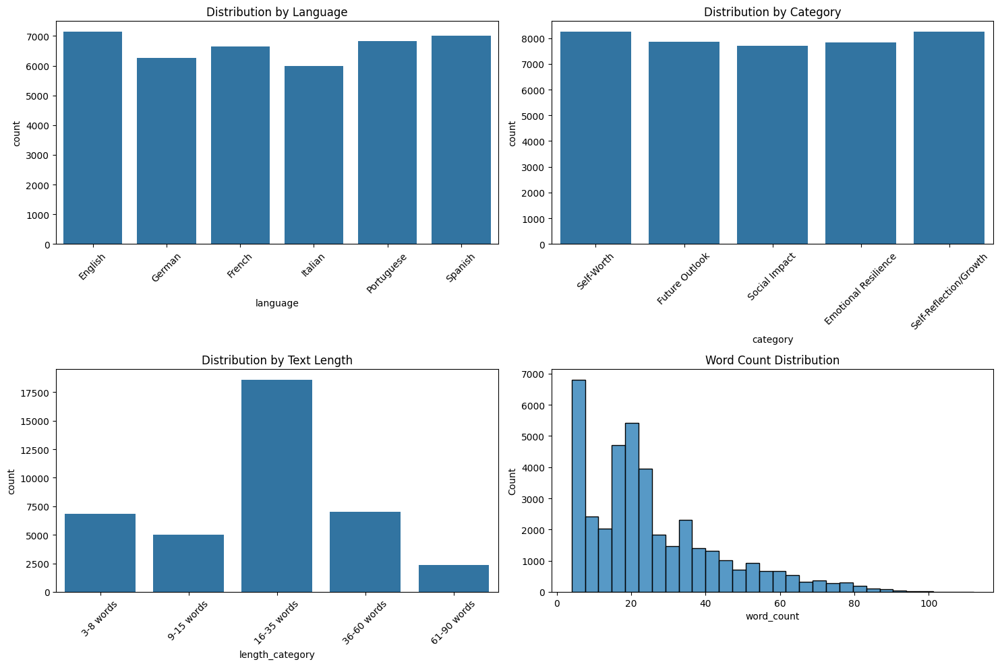

# XLM-RoBERTa Depression Detection Model

[](https://www.python.org/downloads/)
[](https://pytorch.org/)
[](https://huggingface.co/transformers/)
[](LICENSE)
[](https://huggingface.co/malexandersalazar/xlm-roberta-base-cls-depression)

A fine-tuned XLM-RoBERTa model for detecting depression indicators in multilingual text, trained on a rich dataset of 4000+ expressions generated using Claude 3.5 Sonnet (Anthropic's Language Model) through the Message Batches API. The model is available on the Hugging Face Hub.

## 🌟 Key Features

- **Multilingual Support**: Handles text in 6 languages (English, German, French, Italian, Portuguese, Spanish)
- **Hybrid Dataset Composition**:
  - Generated depression-focused data using Claude 3.5 Sonnet (`claude-3-5-sonnet-20241022`)
  - Integration with "tyqiangz/multilingual-sentiments" dataset for broader sentiment coverage
  - Carefully curated across four core dimensions:
    * Languages (balanced across all six supported languages)
    * Mental health states (Healthy vs. Unhealthy)
    * Mental health categories (Self-Worth, Future Outlook, etc.)
    * Text lengths (from short phrases to longer expressions)
- **High Performance**: Achieves state-of-the-art accuracy in depression detection
- **Responsible AI**: Developed with mental health sensitivity in focus
- **Easily Accessible**: Available on Hugging Face Hub

## 📊 Dataset Categories

### Mental Health States
- Healthy
- Unhealthy

### Mental Health Categories
- Self-Worth
- Future Outlook
- Social Impact
- Emotional Resilience
- Self-Reflection/Growth

### Languages
- English
- German
- French
- Italian
- Portuguese
- Spanish

### Text Length Categories
| Length Category | Proportion |
|----------------|------------|
| 3-8 words      | 20%        |
| 9-15 words     | 10%        |
| 16-35 words    | 40%        |
| 36-60 words    | 20%        |
| 61-90 words    | 10%        |

## 🛠️ Technical Architecture

### Data Generation & Processing Pipeline
1. **Input Processing & Categories Definition**
   - Core dataset categories setup:
     * Language support configuration
     * Mental health states (Healthy/Unhealthy)
     * Mental health categories with positive/negative descriptions
     * Text length distribution targets
   - Real depression/resilience testimonials collection

2. **Dynamic Prompt Generation**
   - Custom prompt engineering incorporating:
     * Core categories for balanced dataset generation
     * Random characteristic assignment (age, education, formality, context) for text variety
     * Relevant testimonials selection for authenticity
   - Claude 3.5 Sonnet (`claude-3-5-sonnet-20241022`) integration through Message Batches API
   - Batch processing for generation efficiency

3. **External Dataset Integration**
   - Integration of "tyqiangz/multilingual-sentiments" dataset from Hugging Face
   - Classification of all external data as "Healthy" mental state
     * Rationale: While containing negative sentiments, these texts don't express clinical depression or suicidal ideation
   - Stratification of external dataset by:
     * Language (matching our 6 supported languages)
     * Text length categories

4. **Dataset Merging & Final Balancing**
   - Combining generated depression-focused dataset with external sentiment dataset
   - Multi-dimensional stratification across core categories:
        * Mental health states (Generated unhealthy + Generated healthy + External healthy)
        * Mental health categories
        * Languages
        * Text lengths
   - Quality checks and filtering
   - Final distribution verification and rebalancing
        * Training set: 26208 samples (70.0%)
        * Validation set: 7488 samples (20.0%)
        * Test set: 3745 samples (10.0%)

### Generated Data Analysis

Total number of texts: 39,914 (not including external sentiment dataset)



1. **Distribution by Language**
- English: 7,144 texts (17.9%)
- Spanish: 7,011 texts (17.57%)
- Portuguese: 6,836 texts (17.13%)
- French: 6,653 texts (16.67%)
- German: 6,273 texts (15.72%)
- Italian: 5,997 texts (15.02%)

2. **Distribution by Mental state**
- Healthy: 20,031 texts (50.19%)
- Unhealthy: 17,410 texts (43.62%)

3. **Distribution by Category**
- Self-Reflection/Growth: 8,252 texts (20.67%)
- Self-Worth: 8,249 texts (20.67%)
- Future Outlook: 7,859 texts (19.69%)
- Emotional Resilience: 7,844 texts (19.65%)
- Social Impact: 7,710 texts (19.32%)

4. **Distribution by Text Length**
- 16-35 words: 18,602 texts (46.61%)
- 36-60 words: 7,037 texts (17.63%)
- 3-8 words: 6,822 texts (17.09%)
- 9-15 words: 5,034 texts (12.61%)
- 61-90 words: 2,353 texts (5.9%)

### Model Development
1. **Base Model**: FacebookAI/xlm-roberta-base
2. **Fine-tuning Configuration**
   - Learning rate: 2e-5
   - Warmup ratio: 0.1
   - Weight decay: 0.01
   - Num train epochs: 10
   - Metric for best model: "precision"
   - Batch size: 64
   - Early stopping patience: 5
   - Early stopping threshold: 0.001
3. **Optimization Pipeline**
   - ONNX conversion
   - Quantization
   - Performance benchmarking

## 📈 Performance Metrics

Results from evaluation on our language-agnostic test dataset:

### PyTorch Model Metrics:
- Accuracy: 0.9867
- Precision: 0.9799
- Recall: 0.9827
- F1 Score: 0.9813
- ROC-AUC Score: 0.0927
- Average Inference Time: 145.66 ms
- Inference Time Std: 2.81 ms

### ONNX Model Metrics:
- Accuracy: 0.9871
- Precision: 0.9811
- Recall: 0.9827
- F1 Score: 0.9819
- ROC-AUC Score: 0.0679
- Average Inference Time: 66.88 ms
- Inference Time Std: 1.92 ms

Note: The test dataset maintains the same balanced distribution across languages, mental health states, categories, and text lengths as the training data, ensuring robust evaluation across all supported dimensions.

## 🚀 Getting Started

### Inference
```python
from transformers import AutoModelForSequenceClassification, AutoTokenizer

# Load model directly from Hugging Face Hub
model = AutoModelForSequenceClassification.from_pretrained("malexandersalazar/xlm-roberta-base-cls-depression")
tokenizer = AutoTokenizer.from_pretrained("FacebookAI/xlm-roberta-base")

# Labels/Prediction Values:
# 1: Depression Indicators Present
# 0: No Depression Indicators

# For inference
text = "Your text here"
inputs = tokenizer(
    text,
    padding="max_length",
    truncation=True,
    max_length=512,
    return_tensors="pt"
)
outputs = model(**inputs)
prediction = outputs.logits.argmax(-1).item()
```

## 📁 Project Structure
```
xlm-roberta-base-cls-depression/
├── data/
│   ├── source/                 # Raw data sources
│   ├── raw/                    # Generated texts
│   ├── clean/                  # Processed datasets
│   ├── models/                 # Trained models
│   └── dist/                   # Optimized models
├── notebooks/
│   ├── 1. generator.ipynb      # Dataset generation
│   ├── 2. pre_processor.ipynb  # Text preprocessing
│   ├── 3. trainer.ipynb        # Model training
│   ├── 4. post_training.ipynb  # ONNX optimization
│   └── 5. test.ipynb           # Model testing
└── requirements.txt
```

## ⚠️ Ethical Considerations

This model is designed for research and supportive purposes only. It should not be used as a diagnostic tool or replacement for professional mental health evaluation. Always consult qualified mental health professionals for actual diagnosis and treatment.

### Responsible Usage Guidelines
1. Do not use for medical diagnosis
2. Maintain user privacy and data protection
3. Consider cultural and linguistic nuances
4. Use as part of a broader mental health support system
5. Regular monitoring for biases and errors

## 📄 License

This project is licensed under the MIT License - see the [LICENSE](LICENSE) file for details.

## 🙏 Acknowledgments

- José Ramón Alonso, author of "Depresión: Cómo comprenderla y superarla" - This book provided invaluable insights into understanding depression as a mental health condition and helped shape my approach to responsible dataset generation
- Mental health professionals who validated my approach
- HuggingFace community, particularly the contributors of the "tyqiangz/multilingual-sentiments" dataset
- Open source community for various tools and libraries

## 📚 Citations

If you use this model in your research, please cite:

```bibtex
@software{xlm-roberta-depression,
  title = {XLM-RoBERTa Depression Detection Model},
  year = {2024},
  author = {Alexandr Salazar},
  url = {https://github.com/malexandersalazar/xlm-roberta-base-cls-depression}
}
```

## 📧 Contact

- Project Lead - [Alexander Salazar](mailto:malexandersalazar@outlook.com)