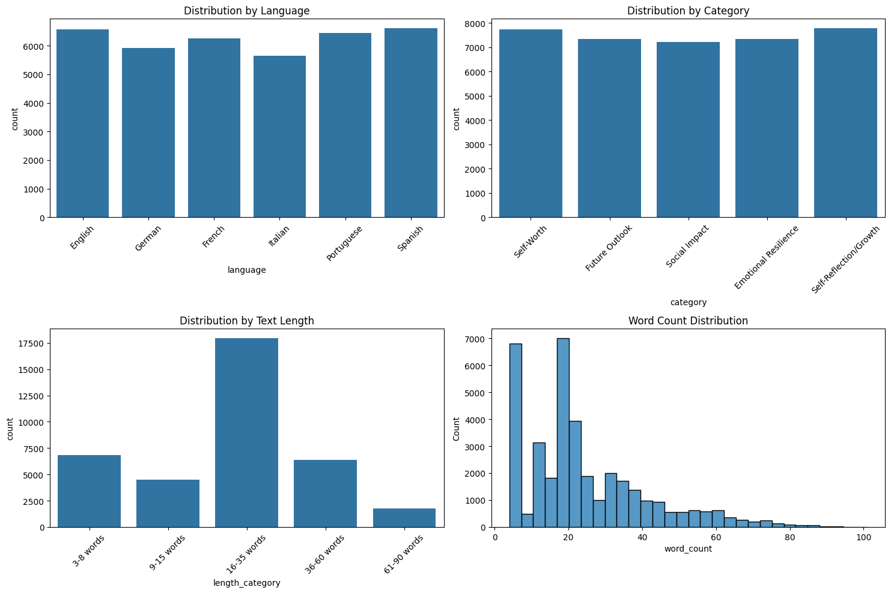

# XLM-RoBERTa Depression Detection Model

[](https://www.python.org/downloads/)
[](https://pytorch.org/)
[](https://huggingface.co/transformers/)
[](LICENSE)
[](https://huggingface.co/malexandersalazar/xlm-roberta-base-cls-depression)

Depression represents one of the most significant global health challenges of our time. According to the World Health Organization (2023), it affects 3.8% of the world's population—approximately 280 million people—making it the leading cause of disability worldwide. The impact is particularly severe among younger populations, with WHO reporting that half of all mental health conditions begin before age 14, and suicide ranking as the fourth leading cause of death among 15-29 year-olds.

This multilingual depression detection model addresses this critical need by leveraging advanced natural language processing to identify depression indicators across six languages. Trained on a rich dataset of 40,000+ expressions generated using Anthropic's Claude 3.5 Sonnet, the model achieves high precision in detecting depression-related content. With depression and anxiety costing the global economy US$ 1 trillion annually in lost productivity (World Bank, 2023), tools for early detection and intervention are more crucial than ever.

The model is available on the Hugging Face Hub, offering a production-ready solution for mental health monitoring and support systems.

## 🌟 Key Features

- **Multilingual Support**: Handles text in 6 languages (English, German, French, Italian, Portuguese, Spanish)
- **Hybrid Dataset Composition**:
  - Generated depression-focused data using Claude 3.5 Sonnet (`claude-3-5-sonnet-20241022`) Message Batches API
  - Integration with "tyqiangz/multilingual-sentiments" dataset for broader sentiment coverage
  - Carefully curated across four core dimensions:
    * Languages (balanced across all six supported languages)
    * Mental health states (Healthy vs. Unhealthy)
    * Mental health categories (Self-Worth, Future Outlook, etc.)
    * Text lengths (from short phrases to longer expressions)
- **High Performance**: Achieves state-of-the-art precision in depression detection
- **Responsible AI**: Developed with mental health sensitivity in focus
- **Easily Accessible**: Available on [Hugging Face Hub](https://huggingface.co/malexandersalazar/xlm-roberta-base-cls-depression)

## 📊 Dataset Categories

### Mental Health States
- Healthy
- Unhealthy

### Mental Health Categories
- Self-Worth
- Future Outlook
- Social Impact
- Emotional Resilience
- Self-Reflection/Growth

### Languages
- English
- German
- French
- Italian
- Portuguese
- Spanish

### Text Length Categories
- 3-8 words
- 9-15 words
- 16-35 words
- 36-60 words
- 61-90 words

## 🛠️ Technical Architecture

### Data Generation & Processing Pipeline
1. **Input Processing & Categories Definition**
   - Core dataset categories setup:
     * Language support configuration
     * Mental health states (Healthy/Unhealthy)
     * Mental health categories with positive/negative descriptions
     * Text length distribution targets
   - Real depression/resilience testimonials collection

2. **Dynamic Prompt & Data Generation**
   - Custom prompt engineering incorporating:
     * Core categories for balanced dataset generation
     * Random characteristic assignment (age, education, formality, context) for text variety
     * Relevant testimonials selection for authenticity
   - Claude 3.5 Sonnet (`claude-3-5-sonnet-20241022`) integration through Message Batches API
   - Batch processing for generation efficiency

3. **External Dataset Integration**
   - Integration of `tyqiangz/multilingual-sentiments` dataset from Hugging Face
   - Classification of all external data as "Healthy" mental state
     * Rationale: While containing negative sentiments, these texts don't express clinical depression or suicidal ideation
   - Stratification of external dataset by:
     * Language (matching our 6 supported languages)
     * Text length categories

4. **Dataset Merging & Final Balancing**
   - Combining generated depression-focused dataset with external sentiment dataset
   - Multi-dimensional stratification across core categories:
        * Mental health states (Generated unhealthy + Generated healthy + External healthy)
        * Mental health categories
        * Languages
        * Text lengths
   - Quality checks and filtering
   - Final distribution verification and rebalancing
        * Training set: 26208 samples (70.0%)
        * Validation set: 7488 samples (20.0%)
        * Test set: 3745 samples (10.0%)

### Data Generation Summary

This summary includes a total of 37,441 dynamically generated texts.



1. **Distribution by Language**
- Spanish: 6,612 texts (17.66%)
- English: 6,565 texts (17.53%)
- Portuguese: 6,438 texts (17.2%)
- French: 6,258 texts (16.71%)
- German: 5,914 texts (15.8%)
- Italian: 5,654 texts (15.1%)

2. **Distribution by Mental Health State**
- Healthy: 20,031 texts (53.5%)
- Unhealthy: 17,410 texts (46.5%)

3. **Distribution by Mental Health Category**
- Self-Reflection/Growth: 7,784 texts (20.79%)
- Self-Worth: 7,747 texts (20.69%)
- Emotional Resilience: 7,354 texts (19.64%)
- Future Outlook: 7,345 texts (19.62%)
- Social Impact: 7,211 texts (19.26%)

4. **Distribution by Text Length**
- 3-8 words: 6,819 texts (18.21%)
- 9-15 words: 4,473 texts (11.95%)
- 16-35 words: 17,968 texts (47.99%)
- 36-60 words: 6,403 texts (17.1%)
- 61-90 words: 1,749 texts (4.67%)

Note: The integration of the external sentiment dataset, `tyqiangz/multilingual-sentiments`, has not been included in this summary.

### Datasets Integration Summary

The `tyqiangz/multilingual-sentiments` dataset offers baseline examples of a "Healthy" mental state, even when negative sentiments are present. While these texts may convey sadness or negative emotions, they do not exhibit clinical depression indicators or suicidal ideation. It is important to distinguish between general negative emotions and markers of clinical depression.

| Split | Samples | Percentage |
|-------|----------|------------|
| Training | 8,028 | 70.0% |
| Validation | 2,294 | 20.0% |
| Test | 1,147 | 10.0% |
| **Total** | **11,469** | **100%** |

The generated dataset, `mental_health_texts.csv` ([`malexandersalazar/mental-health-depression`](https://huggingface.co/datasets/malexandersalazar/mental-health-depression)), features examples with explicit clinical depression indicators. The "Healthy" category includes texts reflecting a normal emotional range and resilience, while the "Unhealthy" category comprises texts exhibiting clear signs of depression and clinical manifestations.

| Split | Samples | Percentage |
|-------|----------|------------|
| Training | 26,208 | 70.0% |
| Validation | 7,488 | 20.0% |
| Test | 3,745 | 10.0% |
| **Total** | **37,441** | **100%** |

**Total Dataset Size**
- **Training**: 34,236 samples (70.0%)
- **Validation**: 9,782 samples (20.0%)
- **Test**: 4,892 samples (10.0%)
- **Total Samples**: 48,910

Note: All splits maintain stratification across languages, categories, and text lengths to ensure representative sampling in each subset.

### Model Development
1. **Base Model**: FacebookAI/xlm-roberta-base
2. **Fine-tuning Configuration**
   - Learning rate: 2e-5
   - Warmup ratio: 0.1
   - Weight decay: 0.01
   - Num train epochs: 10
   - Metric for best model: "precision"
   - Batch size: 64
   - Early stopping patience: 5
   - Early stopping threshold: 0.001
3. **Optimization Pipeline**
   - ONNX conversion
   - Quantization
   - Performance benchmarking

## 📈 Performance Metrics

### Model Metrics

Results from evaluation on the test dataset:

#### PyTorch Model
- Accuracy: 0.9867
- Precision: 0.9799
- Recall: 0.9827
- F1 Score: 0.9813
- ROC-AUC Score: 0.0927
- Average Inference Time: 145.00 ms
- Inference Time Std: 2.78 ms

#### ONNX Model
- Accuracy: 0.9867
- Precision: 0.9799
- Recall: 0.9827
- F1 Score: 0.9813
- ROC-AUC Score: 0.0927
- Average Inference Time: 146.90 ms
- Inference Time Std: 3.08 ms

#### ONNX Quantized Model
- Accuracy: 0.9871
- Precision: 0.9811
- Recall: 0.9827
- F1 Score: 0.9819
- ROC-AUC Score: 0.0679
- Average Inference Time: 74.49 ms
- Inference Time Std: 7.80 ms

Note: The test dataset maintains the same balanced distribution across languages, mental health states, categories, and text lengths as the training data, ensuring robust evaluation across all supported dimensions.

### Model Benchmarking

- **Test Dataset**: [thePixel42/depression-detection](https://huggingface.co/datasets/thePixel42/depression-detection) (English-only dataset)
- **Comparison Scope**: Base models only, no comparisons against larger models (e.g., RoBERTa-large variants)

#### Performance Comparison

| Model | Accuracy | Precision | Recall | F1 Score |
|-------|----------|----------|---------|-----------|
| [depression-reddit-distilroberta-base](https://huggingface.co/mrjunos/depression-reddit-distilroberta-base) | 0.7604 | 0.6937 | 0.9360 | **0.7968** |
| [xlm-roberta-base-cls-depression](https://huggingface.co/malexandersalazar/xlm-roberta-base-cls-depression) | **0.7841** | **0.8458** | 0.6967 | 0.7640 |
| [finetuned-distil-bert-depression](https://huggingface.co/ShreyaR/finetuned-distil-bert-depression) | 0.7135 | 0.6475 | 0.9419 | 0.7674 |
| [finetuned-roberta-depression](https://huggingface.co/ShreyaR/finetuned-roberta-depression) | 0.6820 | 0.6164 | **0.9701** | 0.7538 |
| [distilroberta-base-finetuned-suicide-depression](https://huggingface.co/mrm8488/distilroberta-base-finetuned-suicide-depression) | 0.5663 | 0.5605 | 0.6291 | 0.5928 |

The xlm-roberta-base-cls-depression model demonstrates strong performance, achieving the highest accuracy and precision among compared models. This is particularly noteworthy given that it maintains multilingual capabilities while competing against English-specialized models. The results suggest effective transfer learning and robust depression detection capabilities across different linguistic contexts.

## 🚀 Getting Started

### Inference
```python
from transformers import AutoModelForSequenceClassification, AutoTokenizer

# Load model directly from Hugging Face Hub
model = AutoModelForSequenceClassification.from_pretrained("malexandersalazar/xlm-roberta-base-cls-depression")
tokenizer = AutoTokenizer.from_pretrained("FacebookAI/xlm-roberta-base")

# Labels/Prediction Values:
# 1: Depression Indicators Present
# 0: No Depression Indicators

# For inference
text = "Your text here"
inputs = tokenizer(
    text,
    padding="max_length",
    truncation=True,
    max_length=512,
    return_tensors="pt"
)
outputs = model(**inputs)
prediction = outputs.logits.argmax(-1).item()
```

## 📁 Project Structure
```
xlm-roberta-base-cls-depression/
├── data/
│   ├── source/                 # Raw data sources
│   ├── raw/                    # Generated texts
│   ├── clean/                  # Processed datasets
│   ├── models/                 # Trained models
│   └── dist/                   # Optimized models
├── notebooks/
│   ├── 1. generator.ipynb      # Dataset generation
│   ├── 2. pre_processor.ipynb  # Text preprocessing
│   ├── 3. trainer.ipynb        # Model training
│   ├── 4. post_training.ipynb  # ONNX optimization
│   └── 5. test.ipynb           # Model testing
└── requirements.txt
```

## ⚠️ Ethical Considerations

This model is designed for research and supportive purposes only. It should not be used as a diagnostic tool or replacement for professional mental health evaluation. Always consult qualified mental health professionals for actual diagnosis and treatment.

### Responsible Usage Guidelines
1. Do not use for medical diagnosis
2. Maintain user privacy and data protection
3. Consider cultural and linguistic nuances
4. Use as part of a broader mental health support system
5. Regular monitoring for biases and errors

## 📄 License

This project is licensed under the MIT License - see the [LICENSE](LICENSE) file for details.

## 🙏 Acknowledgments

- José Ramón Alonso, author of `Depresión: Cómo comprenderla y superarla` - This book provided invaluable insights into understanding depression as a mental health condition and helped shape my approach to responsible dataset generation
- Mental health professionals who validated my approach
- HuggingFace community, particularly the contributors of the `tyqiangz/multilingual-sentiments` dataset
- Open source community for various tools and libraries

## 📚 Citations

If you use this model in your research, please cite:

```bibtex
@software{malexandersalazar_xlm_roberta_base_cls_depression,
    author = {Alexander Salazar},
    title = {XLM-RoBERTa Depression Detection Model},
    year = {2025},
    month = {1},
    url = {https://github.com/malexandersalazar/xlm-roberta-base-cls-depression},
    version = {1.0.0},
    date = {2025-01-03},
    abstract = {A fine-tuned XLM-RoBERTa model for detecting depression indicators in multilingual text, trained on a rich dataset of 40,000+ expressions generated using Claude 3.5 Sonnet (claude-3-5-sonnet-20241022) through the Message Batches API. The model achieves high precision and is available on the Hugging Face Hub.},
    keywords = {depression-detection, mental-health, xlm-roberta, multilingual, natural-language-processing}
}
```

## 📧 Contact

- Project Lead - [Alexander Salazar](mailto:malexandersalazar@outlook.com)